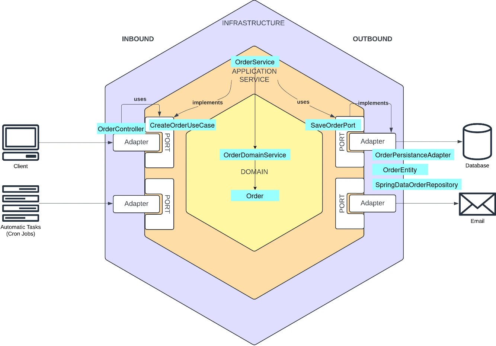

[//]: # (# Hexagonal Demo)

[//]: # ()
[//]: # (## Overview)

[//]: # ()
[//]: # (This project demonstrates a hexagonal architecture example in Java.)

[//]: # ()
[//]: # (## Architecture)

[//]: # ()
[//]: # ([//]: # &#40;![Architecture Diagram]&#40;images/HexagonalDDD.png&#41;&#41;)
[//]: # (<p align="center">)

[//]: # (    )

[//]: # (</p>)

[//]: # ()
[//]: # (It separates:)

[//]: # (- Domain logic)

[//]: # (- Application services)

[//]: # (- Infrastructure)

[//]: # ()
[//]: # (## How to run)

[//]: # ()

## 📌 Overview

This project demonstrates a **Hexagonal Architecture (Ports & Adapters)** combined with **Domain-Driven Design (DDD)** using:

- Java 21
- Spring Boot 4.0.3
- Spring Data JPA
- H2 Database
- Kafka (consumer)
- Clean separation of layers

It includes:
- REST API (Create, Get, Update Order)
- Domain Service (business rules)
- DTO + Mapper pattern
- Kafka consumer (async processing)
- Email sending via port & adapter

---

## 🧱 Architecture

            ┌──────────────────────┐
            │   REST Controller    │
            │   Kafka Listener     │
            └─────────┬────────────┘
                      ↓
            ┌──────────────────────┐
            │  Application Layer   │
            │ (Use Cases)          │
            └─────────┬────────────┘
                      ↓
            ┌──────────────────────┐
            │    Domain Layer      │
            │ (Order + Rules)   │
            └─────────┬────────────┘
                      ↓
            ┌──────────────────────┐
            │ Infrastructure Layer │
            │ (DB, Kafka, Email)   │
            └──────────────────────┘

<p align="center">
    
</p>

### Creating an Order flow:
```
Controller (Inbound Adapter, Infra)
            ↓
CreateOrderUseCase (Inbound Port, App)
            ↓
OrderService (Application Service, App)
            ↓
Order (Model, Domain)
            ↓
OrderDomainService (Service, Domain)
            ↓
SaveOrderPort (Outbound Port, App)
            ↓
JPA Adapter (Outbound Adapter, Infra)

```
---

## 📁 Project Structure

```
com.example.app
├── domain
│ ├── model
│ └── service
├── application
│ ├── port
│ │ ├── in
│ │ └── out
│ └── service
├── infrastructure
│ ├── adapter
│ │ ├── in (web, messaging)
│ │ └── out (persistence, email)
│ └── config
└── App.java
```

---

## 🧠 Key Concepts

### Domain Layer (Core)
- Contains business logic
- Framework-independent
- Example:
    - `Order` (Aggregate)
    - `OrderDomainService` (business rules)

### Application Layer (Use Cases)
- Orchestrates use cases
- Defines ports
- Example:
    - `CreateOrderUseCase` (Inbound Port)
    - `SaveOrderPort`, `LoadOrderPort` (Outbound Port)

### Infrastructure Layer (Adapters)
- Implements ports
- Contains:
    - REST Controllers (IN adapter)
    - Kafka Listener (IN adapter)
    - JPA Repositories (OUT adapter)
    - Email Adapter (OUT adapter)

---

## 🚀 Features

### Create Order

POST /orders

### Get Order

GET /orders/{id}

### Update Order

PUT /orders/{id}

### Kafka Consumer
- Listens to: `order-events`
- Sends email if event is important

---

## 🧩 Design Principles Applied

- Hexagonal Architecture (Ports & Adapters)
- Domain-Driven Design (DDD)
- Separation of Concerns
- Dependency Inversion
- Clean Architecture

---

## ⚠️ Important Notes

### Avoid

- Business logic in controllers
- Direct DB access from application layer
- Exposing domain objects in API

### Use

- DTOs + Mapper
- Ports for all external dependencies
- Domain services for business rules